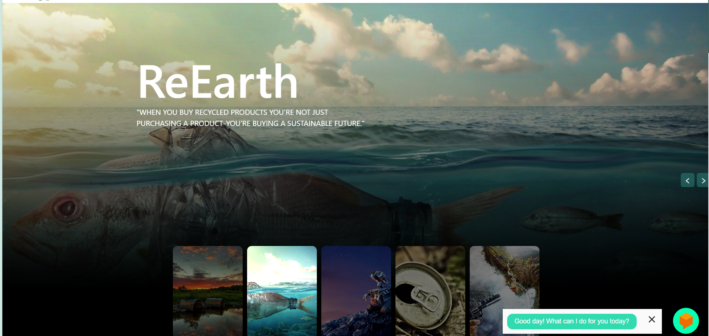
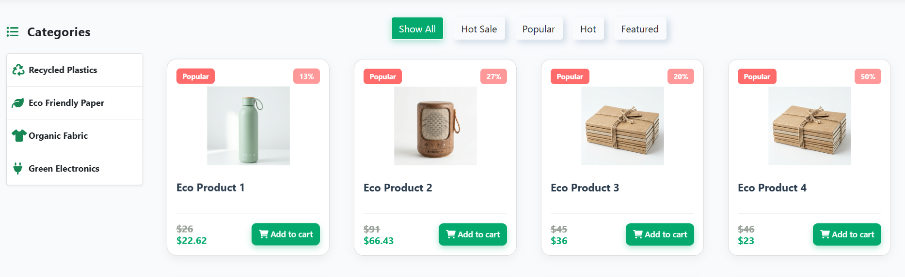

# 🌿 ReEarth - Nền Tảng Thương Mại Điện Tử Xanh (Green E-commerce Platform)

Chào mừng bạn đến với **ReEarth**! Đây là dự án thương mại điện tử chuyên cung cấp các sản phẩm tái chế, thân thiện với môi trường, hướng tới một tương lai phát triển bền vững. 

*"When you buy recycled products you're not just purchasing a product - you're buying a sustainable future"*

## 📸 Giao diện trang web (Screenshots)

Dưới đây là một số hình ảnh thực tế của trang web mà mình đã thu thập và chụp lại:

### 1. Banner Trang chủ (Home Banner)


### 2. Danh mục & Sản phẩm (Products)


## 🚀 Các tính năng nổi bật (Features)
- **Giao diện UI/UX cao cấp**: Thiết kế chuẩn Minimalist (tối giản), các thành phần có hiệu ứng bo góc và đổ bóng (Shadow) tinh tế, hiện đại.
- **Thanh điều hướng (Navbar) tối ưu**: Bố cục cực kỳ logic, thiết kế Profile Pill bo tròn chống bẻ hàng, giao diện tương tác đẹp mắt.
- **Trải nghiệm mua sắm hoàn hảo**: Ảnh sản phẩm hiển thị chuẩn kích thước (`object-fit: contain`), không bị cắt xén, khoảng cách thẻ (gap) rộng rãi, thoáng đãng.
- **Hệ thống Giỏ hàng & Thanh toán (Cart & Checkout)**: Mượt mà và nhanh chóng.
- **Góc chia sẻ (Blog)**: Nơi lan tỏa những mẹo vặt sống xanh.

## 💻 Hướng dẫn Cài đặt & Chạy ứng dụng (Installation)

Dự án này được phát triển trên **Laravel**. Để chạy thử nghiệm trên máy tính (local), bạn làm theo các bước sau:

1. **Cài đặt các thư viện cần thiết (Dependencies)**:
   ```bash
   composer install
   npm install
   ```
2. **Thiết lập file môi trường**:
   Copy nội dung file `.env.example` thành file `.env` mới, sau đó tạo khóa bí mật:
   ```bash
   copy .env.example .env
   php artisan key:generate
   ```
3. **Cấu hình Database và chạy dữ liệu mẫu (Migration & Seed)**:
   Mở file `.env`, cập nhật thông tin Database (DB_DATABASE, DB_USERNAME, DB_PASSWORD...). Sau đó chạy lệnh:
   ```bash
   php artisan migrate --seed
   ```
4. **Khởi động dự án**:
   Bạn cần mở 2 cửa sổ Terminal (Command Prompt / PowerShell) và chạy 2 lệnh sau song song:
   
   *Terminal 1 (Backend):*
   ```bash
   php artisan serve
   ```
   
   *Terminal 2 (Frontend Assets):*
   ```bash
   npm run dev
   ```
5. **Truy cập trang web**: Mở trình duyệt bằng cách truy cập vào địa chỉ hiện lên trên Terminal.

## 🛠️ Công nghệ sử dụng (Tech Stack)
- **Backend:** Laravel Framework (PHP)
- **Frontend:** Blade Templates, CSS3 nguyên bản (Vanilla), JavaScript, Bootstrap
- **Database:** MySQL (hoặc SQLite)

---
**🌱 Phát triển cho dự án ReEarth - Chung tay bảo vệ trái đất!**
